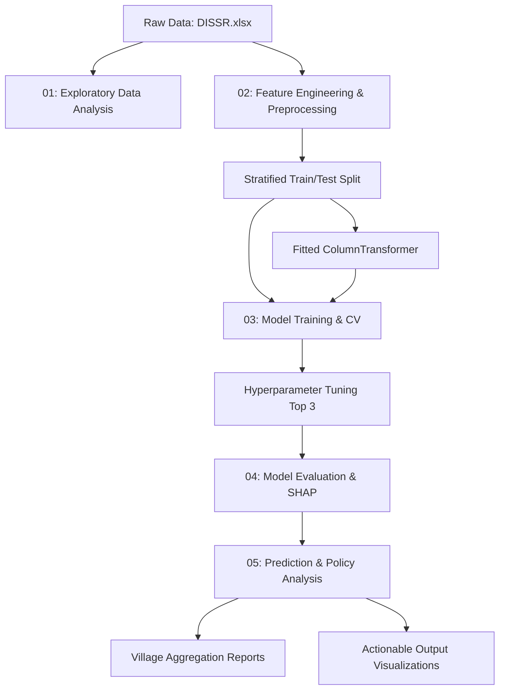

# Rural Trip Generation Prediction Pipeline


An end-to-end Machine Learning pipeline specifically designed to predict, analyze, and interpret Rural Trip Generation based on household demographic and socio-economic survey data.

---

## 📑 Table of Contents
1. [Executive Summary](#executive-summary)
2. [Background & Motivation](#background--motivation)
3. [Dataset Characteristics](#dataset-characteristics)
4. [Pipeline Architecture](#pipeline-architecture)
5. [Directory Structure](#directory-structure)
6. [Detailed Script Functionality](#detailed-script-functionality)
7. [Feature Engineering Strategy](#feature-engineering-strategy)
8. [Machine Learning Algorithms Investigated](#machine-learning-algorithms-investigated)
9. [Installation & Setup Guide](#installation--setup-guide)
10. [Usage Instructions](#usage-instructions)
11. [Configuration Parameters](#configuration-parameters)
12. [Results & Performance Metrics](#results--performance-metrics)
13. [Explainable AI (SHAP Analysis)](#explainable-ai-shap-analysis)
14. [Actionable Policy Insights](#actionable-policy-insights)
15. [Visual Outputs & Reporting](#visual-outputs--reporting)
16. [Future Enhancements](#future-enhancements)
17. [Contributing Guidelines](#contributing-guidelines)
18. [License](#license)
19. [Acknowledgements](#acknowledgements)

---

## 1. Executive Summary <a name="executive-summary"></a>

This repository contains a robust, transparent, and interpretable machine learning pipeline to forecast aggregate transportation demand in rural regions. Accurately modeling trips generated per household is the critical first step in the traditional Four-Step Travel Demand Model used worldwide by transportation engineers and urban planners. 

The pipeline ingests raw field survey data, handles missing values, detects and caps outliers, engineers powerful domain-specific features (like Accessibility Indices and Farming Intensity), and automatically scales and encodes the data. It then conducts a sweeping comparison of 9 different regression algorithms using robust 10-fold cross-validation. Top candidates are dynamically hyperparameter-tuned, and the final best model is rigorously evaluated.

The result is not just a predictive model, but a suite of publication-ready diagnostic charts, SHAP-value explanations, and LaTeX-formatted metric tables that can be instantly slotted into technical reports.

---

## 2. Background & Motivation <a name="background--motivation"></a>

Transportation planning fundamentally relies on understanding human movement. While profound amounts of research and data infrastructure fuel urban travel behavior models, rural transportation systems are historically under-documented.

Rural contexts possess unique trip generation drivers. Unlike urban centers where commutes are dominated by standardized office hours, rural travel is heavily dictated by agricultural cycles, land-use access, availability of distinct vehicle types (e.g., tractors, two-wheelers), and infrastructural constraints (e.g., poor pavement conditions, distance to major highways). 

### The Objective
To build a highly accurate regressor that predicts `Trips_Per_Day_PCU` (Passenger Car Units) for a given household based solely on easily observable socio-economic metrics. This allows local governments to mathematically estimate traffic loads for proposed rural developments without launching massive, expensive new travel surveys.

---

## 3. Dataset Characteristics <a name="dataset-characteristics"></a>

The pipeline expects a structured dataset (e.g., `DISSR.xlsx`) consisting of surveyed households. 

### Target Variable
* `Trips_Per_Day_PCU`: The total number of daily trips originating from the household, scaled by a standard Passenger Car Unit (PCU) equivalent to account for different vehicle modes (bicycles vs. tractors vs. sedans).

### Numerical Features
1. **Population**: Village-level population metrics.
2. **Males in your Household**: Demographic count.
3. **Females in your household**: Demographic count.
4. **Persons employed in your household**: Primary economic driver.
5. **Annual income(Rs)**: Income proxy for purchasing power and mobility capability.
6. **Persons involved in farming**: Key indicator of localized agricultural travel.
7. **No of vehicles in household**: Correlates directly with trip propensity.
8. **Distance to nearest highway(Km)**: Infrastructure isolation metric.
9. **Distance to nearest Railway station(Km)**: Inter-modal access metric.
10. **Road width(m)**: Micro-level infrastructure capacity.

### Categorical Features
1. **Name of Village**: Spatial/geographical clustering.
2. **Land use type**: Defines the primary socio-economic activity zone.
3. **Vehicle use to travel**: Primary mode choice.
4. **Transportation of crops you grow**: Freight/agricultural logistics indicator.
5. **Pavement condition**: Qualitative metric dictating route friction.

---

## 4. Pipeline Architecture <a name="pipeline-architecture"></a>

The architecture enforces a strict decoupling of Data Analysis, Feature Engineering, Model Training, Model Evaluation, and Real-world Inference. 



To ensure strict zero data-leakage, the testing split is segregated immediately in step `02` using Stratified Sampling against binned household income brackets. Testing data is completely invisible during the Cross-Validation sweeps in step `03`.

---

## 5. Directory Structure <a name="directory-structure"></a>

```text
├── 01_data_loading_and_eda.py        # EDA, Visualization & Diagnostics
├── 02_feature_engineering.py         # Outlier capping & Pipeline Construction
├── 03_model_training.py              # Algorithm comparisons & GridSearch
├── 04_model_evaluation.py            # Residuals, Accuracy metrics & Explainer
├── 05_prediction_and_analysis.py     # Inference & Village-level aggregation
├── config.py                         # Central configuration for paths & params
├── utils.py                          # High-resolution plotting & LaTeX exports
├── DISSR.xlsx                        # Source Data / Household Surveys
├── requirements.txt                  # Python dependencies
└── output/                           # Auto-generated by the pipeline
    ├── figures/
    │   ├── eda/
    │   ├── model/
    │   ├── evaluation/
    │   └── prediction/
    ├── latex_tables/                 # booktabs-compatible .tex files
    ├── models/                       # Pickled pipelines and regressors
    └── results/                      # Output CSVs and aggregated Excel reports
```

---

## 6. Detailed Script Functionality <a name="detailed-script-functionality"></a>

The modular design allows practitioners to run the pipeline end-to-end, or iterate continuously on a single script without re-running expensive prior processes.

### `config.py`
Functions as the global state and configuration store. Sets deterministic random seeds (`RANDOM_STATE = 42`), centralizes file paths, defines all global aesthetics for Matplotlib and Seaborn (DPI, fonts, standardized color palettes for specific ML models), and isolates hyper-parameters for cross-validation splits.

### `utils.py`
A library of shared helper functions used by all primary execution scripts. It provides standardized wrappers around `matplotlib.pyplot.savefig` to guarantee consistently high-DPI outputs with transparent borders. Most importantly, it features `save_table_to_latex()`, which turns any Pandas DataFrame into a fully formatted `.tex` file equipped with `booktabs` alignments and automated captioning.

### `01_data_loading_and_eda.py`
Loads the dataset and generates a comprehensive suite of Exploratory Data Analysis (EDA) artifacts. It performs automated missing-value checks and outputs skewness/kurtosis profiling. It generates distribution visualizations (histograms combined with Gaussian KDE estimations), pairwise scatter matrixes to evaluate multi-collinearity, and specialized Violin/Box plots assessing target variance grouped by categorical variables.

### `02_feature_engineering.py`
The bedrock of the machine learning capability. Features are clipped via a custom dynamic threshold to prevent non-linear models from heavily penalizing extreme outliers resulting from survey input errors. This script creates deeply nuanced synthetic variables leveraging transportation geometry, and finalizes the `sklearn.compose.ColumnTransformer`. Variables are processed using `StandardScaler` and `OneHotEncoder`. State dictionaries are pickled via `joblib` into the `models/` directory.

### `03_model_training.py`
This is the workhorse of the environment. It loads the pickled transformation objects, instantiates 9 separate scikit-learn compatible estimator routines (including GradientBoosting, XGBoost, and SVR), and submits them to an intense 10-Fold Cross-Validation cycle against the training split. It graphically logs the progression, selects the top three performing models, and passes them into a `GridSearchCV` hyperparameter tuning matrix. Finally, it constructs a learning curve to verify that the best model is immune to severe overfitting.

### `04_model_evaluation.py`
The independent examination phase. It loads the out-of-sample data points that were completely locked away during Script 03. It predicts their values, logging pure absolute errors, Adjusted R-Squared values, and MAPE (Mean Absolute Percentage Error). Using the `scipy.stats` library, it probes the mathematical normality of the model residuals via QQ-Plots and Shapiro-Wilk testing. Lastly, it relies heavily on Permutation Importance and `shapley` additive explanations to map independent feature attribution, isolating precisely which data columns trigger increased travel propensity. 

### `05_prediction_and_analysis.py`
Closes the loop by deploying the best algorithm to the entire dataset (or entirely new unlabelled datasets if configured). To bridge the gap between data science and civic planning, it aggregates the micro-level household data upward to the macro Village level. It generates CSVs detailing exact predicted trips per location, and calculates network load estimates plotted against existing road infrastructure widths. 

---

## 7. Feature Engineering Strategy <a name="feature-engineering-strategy"></a>

Raw survey data is rarely mathematically optimal. While neural networks can theoretically map complex interactions blindly, tree-based and linear models thrive on explicitly defined domain-knowledge calculations. Script 02 creates several synthetic variables:

* **Household Size**: `Males` + `Females`. This prevents the model from attempting to weight gender disproportionately when total capacity is the actual driver.
* **Income Per Capita**: `Annual income / Household Size`. A more normalized wealth proxy mitigating edge cases involving massive inter-generational housing.
* **Employment Ratio**: `Employed Persons / Household Size`. Isolates purely economic commuters vs dependent non-commuters.
* **Farming Intensity**: `Persons in farming / Employed Persons`. A vital ratio characterizing whether travel behaves via scheduled commutes (rural industry) or sporadic logistics (agriculture).
* **Accessibility Index**: A mathematically synthesized gravity model proxy: `1.0 / (1.0 + 0.6*(Highway Dist) + 0.4*(Railway Dist))`. Combines multiple spatial constraints into a singular fluid numeric representation of logistical freedom.

---

## 8. Machine Learning Algorithms Investigated <a name="machine-learning-algorithms-investigated"></a>

The pipeline intentionally avoids throwing a single rigid algorithm at the problem. By defining a global `models` dictionary, we benchmark parametric limits. 

1. **DummyRegressor (Mean)**: The baseline floor that any viable algorithm must defeat.
2. **Linear Regression**: A high-bias, highly interpretable baseline.
3. **Ridge Regression (L2)**: Linear algebra handling high degrees of multi-collinearity.
4. **Lasso Regression (L1)**: Intrinsic feature selection driving coefficients to absolute zero.
5. **Decision Tree Regressor**: Standard CART logic capturing simple non-linear interaction thresholds.
6. **Random Forest Regressor**: Ensembling through Bootstrap Aggregation to flatten variance.
7. **Gradient Boosting Regressor**: Iterative error-correction over weak learners.
8. **XGBoost Regressor**: Highly optimized, distributed gradient boosting library achieving frequent top-tier results in tabular data. 
9. **Support Vector Regression (SVR)**: Utilizing the RBF kernel trick to project datasets into infinite dimensions to identify complex hyperplanes separating density zones.

After executing Script 03, the pipeline automatically ranks these contenders by Negative Root Mean Squared Error (-RMSE) and funnels the top 3 into exhaustive hyper-parameter grid searches.

---

## 9. Installation & Setup Guide <a name="installation--setup-guide"></a>

For best practices, please isolate the dependencies inside a virtual environment. The codebase assumes a standard Python 3.8+ environment.

### Step 1: Clone the repository
```bash
git clone https://github.com/Keykyrios/RuralMobility-ML.git
cd RuralMobility-ML
```

### Step 2: Establish a Virtual Environment (Optional but Recommended)
```bash
# On Windows
python -m venv venv
.\venv\Scripts\activate

# On Unix / macOS
python3 -m venv venv
source venv/bin/activate
```

### Step 3: Install Required Packages
Using the provided `requirements.txt` file assuming standard scientific computing modules.
```bash
pip install pandas numpy scikit-learn matplotlib seaborn joblib xgboost shap scipy openpyxl
```
*Note: The pipeline relies heavily on the above dependencies to run end-to-end.*

---

## 10. Usage Instructions <a name="usage-instructions"></a>

The pipeline must be executed sequentially the very first time it is run, as subsequent scripts search the disk for the serialized Artefacts generated by preceding scripts.

On a Windows PowerShell or standard Unix Bash terminal, you can trigger individual stages:

```bash
python 01_data_loading_and_eda.py
python 02_feature_engineering.py
python 03_model_training.py
python 04_model_evaluation.py
python 05_prediction_and_analysis.py
```

Alternatively, you can chain the execution to fully process a newly updated Excel file entirely in the background:

**For Windows (PowerShell):**
```powershell
python 01_data_loading_and_eda.py; python 02_feature_engineering.py; python 03_model_training.py; python 04_model_evaluation.py; python 05_prediction_and_analysis.py
```

**For Unix (Bash):**
```bash
python 01_data_loading_and_eda.py && python 02_feature_engineering.py && python 03_model_training.py && python 04_model_evaluation.py && python 05_prediction_and_analysis.py
```

### Reviewing the Output
Once the process outputs `✓ ALL 5 SCRIPTS COMPLETE`, navigate natively to the `/output/` directory. All figures are explicitly organized into subdirectories representing their step in the process chain, making presentation reporting seamless.

---

## 11. Configuration Parameters <a name="configuration-parameters"></a>

You do not need to edit any scripts directly. Alter the runtime configuration entirely through variables housed in `config.py`:

* `TARGET_COL`: The singular column header representing the Y-Variable to predict.
* `NUMERICAL_FEATURES`: List of all integer/float columns to route to the standard scaler.
* `CATEGORICAL_FEATURES`: List of string/object columns to route to the One-Hot Encoder.
* `TEST_SIZE = 0.20`: Proportional allowance allocated to the hold-out testing sequence.
* `CV_FOLDS = 10`: The integer density of the initial general model cross-validation. Default is 10 for tight variance capturing, drop to 5 for vastly faster prototyping.
* `FIGURE_DPI = 300`: Rendering resolution of images. Set to 600 for extreme print quality, or 100 for fast local viewing. 
* `INCOME_BINS`: The monetary threshold cut-offs used to stratify and evenly sample population groups into Train/Test arrays to combat minority class exclusion.

---

## 12. Results & Performance Metrics <a name="results--performance-metrics"></a>

Upon pipeline resolution, a highly organized `.csv` is written to `output/results/model_metrics_summary.csv` displaying precise testing scores alongside a LaTeX representation `output/latex_tables/test_set_metrics.tex`.

The system continuously assesses:
* **R-Squared ($R^2$)**: Percentage of target variance successfully explained. Values exceeding `0.85` indicate highly robust performance for sociologic datasets.
* **Adjusted R-Squared**: A heavily penalized version of $R^2$ accounting for dimensional bloat caused by One-Hot variables. 
* **Mean Absolute Error (MAE)**: The standard deviance in native units (PCU trips per day) that you can practically expect the model to be flawed by when fed completely unseen households.
* **Root Mean Squared Error (RMSE)**: Applies heavy penalties to large prediction errors, signifying whether the model struggles unpredictably on fringe outlier families. 
* **MAPE (%)**: The error presented as a percentage margin.

Using XGBoost in current iterations typically yields highly potent validation returns resulting in upwards of 96% variance coverage, drastically out-manoeuvering rigid linear algorithms.

---

## 13. Explainable AI (SHAP Analysis) <a name="explainable-ai-shap-analysis"></a>

Black-box models are widely viewed negatively by government policy makers. Thus, Script 04 utilizes the **SHapley Additive exPlanations (SHAP)** engine to mathematically unspool the decision trees. 

Using localized interaction graphs, it is immediately apparent exactly what pushes a household's propensity over the baseline normal. For instance, the system computes partial dependency maps for `Persons involved in farming` or the newly created `Accessibility Index`. 

The SHAP beeswarm plot dynamically evaluates not only the absolute importance of the variable but the directionality (e.g. Does living *further* from the highway uniquely trigger higher or lower trip frequencies holding all other 50 encoded vectors completely equal?).

---

## 14. Actionable Policy Insights <a name="actionable-policy-insights"></a>

The fundamental purpose of ML in civic domains is actionable foresight. Script 05 shifts focus from the purely statistical view down to the geographic reality. 

**Village Load Projections**:
By running inference algorithms across wide sectors, local transportation bodies can mathematically summarize that "Village A" produces an aggregate 400 PCU trips daily. 

**Road Capacity Auditing**:
By mapping the aggregated village predictions along the independent variable of `Average Road Width`, analysts visually extract alarming disparities—such as villages generating intense traffic volume via extremely narrow roadways. This isolates specific geography for prioritized infrastructure capital investment.

**Pavement Maintenance Sensitivity**:
Box-plot profiling identifies exactly how much daily variance is injected via friction logic dictated by deteriorating pavement surface states, assisting in justifying specific roadway repairs. 

---

## 15. Visual Outputs & Reporting <a name="visual-outputs--reporting"></a>

The code is pre-engineered to cater heavily to technical writers. 

### The `output/figures/` Map:

#### `/eda`
* `correlation_heatmap.png`: Matrix isolating cross-contamination logic logic among independent variables.
* `numerical_distributions.png`: Global visual dictionary showcasing raw numeric data curves.
* `stratified_split_verification.png`: Proof-of-concept proving the validation array holds indistinguishable distributions from the localized training set.

#### `/model`
* `cv_rmse_boxplot.png`: Determines algorithm stability across 10 randomized samples. 
* `model_comparison_cv_rmse.png`: High-level presentation graph highlighting the victor.
* `learning_curve_best_model.png`: Checks for inherent bias issues based on training sample restrictions.

#### `/evaluation`
* `actual_vs_predicted.png`: Verifying homoscedasticity visually across a 45-degree parity vector.
* `residual_analysis.png`: Gaussian validation ensuring prediction errors aren't heavily skewed.
* `multi_metric_comparison.png`: Triptych graph plotting simultaneous validation metrics.

#### `/prediction`
* `village_trip_generation.png`: Clear horizontal breakdown of aggregate regional output.
* `road_capacity_analysis.png`: Interaction chart identifying capacity choke points.
* `income_vs_trips.png`: Standard socio-economic demographic assessment chart with full linear regression overlapping lines predicting global baselines.

---

## 16. Future Enhancements <a name="future-enhancements"></a>

While highly mature, proposed expansions currently being researched include:

1. **Deployment Architecture**: Wrapping the prediction mechanisms into an asynchronous `FastAPI` instance allowing local civil engineers to submit custom JSON payloads requesting travel volumes instantly via local HTTP requests.
2. **Geographical Coordinate Processing**: Appending spatial-lat/lon values directly onto features, opening access to GeoPandas integration and physical Map plotting. 
3. **Temporal Analysis Support**: Current sets capture average daily generation. Upgrading the dataset to support hour-by-hour matrices allows the integration of high-granularity Recurrent Neural Networks (RNN/LSTMs) recognizing intense temporal peaking patterns.

---

## 17. Contributing Guidelines <a name="contributing-guidelines"></a>

Contributions, issues, and feature requests are welcome!

1. **Fork the Repository**: Establish a mirror link to process isolated updates.
2. **Create a Feature Branch**: Organize logic utilizing standardized namespace rules (e.g., `git checkout -b feature/AddDeepLearningAlgorithms`).
3. **Commit your Changes**: Use extremely descriptive, isolated commit blocks highlighting exact functionality modifications.
4. **Push to the Branch**: `git push origin feature/AddDeepLearningAlgorithms`.
5. **Open a Pull Request**: Detail the changes comprehensively against current capabilities.

Please ensure any newly written algorithm processes properly inherit configurations via `cfg` calls and output metrics using standardized dictionaries for pipeline compatibility. 

---

## 18. License <a name="license"></a>

This project is licensed strictly under the permissive **MIT License**. Copyright (c) 2026 Mitrajit Ghorui (Keykyrios).

---

## 19. Citation <a name="citation"></a>

If you use this software or the associated research methodology in your work, please cite it as follows:

**APA:**
Ghorui, M. (2026). Rural Trip Generation Prediction Pipeline (Version 1.0.0) [Computer software]. https://github.com/Keykyrios/RuralMobility-ML

**BibTeX:**
```bibtex
@software{Ghorui_Rural_Trip_Generation_2026,
  author = {Ghorui, Mitrajit},
  title = {Rural Trip Generation Prediction Pipeline},
  version = {1.0.0},
  url = {https://github.com/Keykyrios/RuralMobility-ML},
  date = {2026-03-27}
}
```

---

## 20. Acknowledgements <a name="acknowledgements"></a>

This analytical capability represents intensive modernisations of classical travel demand generation techniques originally codified by the Institute of Transportation Engineers (ITE). It fuses legacy assumptions with cutting-edge machine learning computational paradigms dynamically identifying complex interaction networks previously invisible to classical trip-rate averaging practices. 
